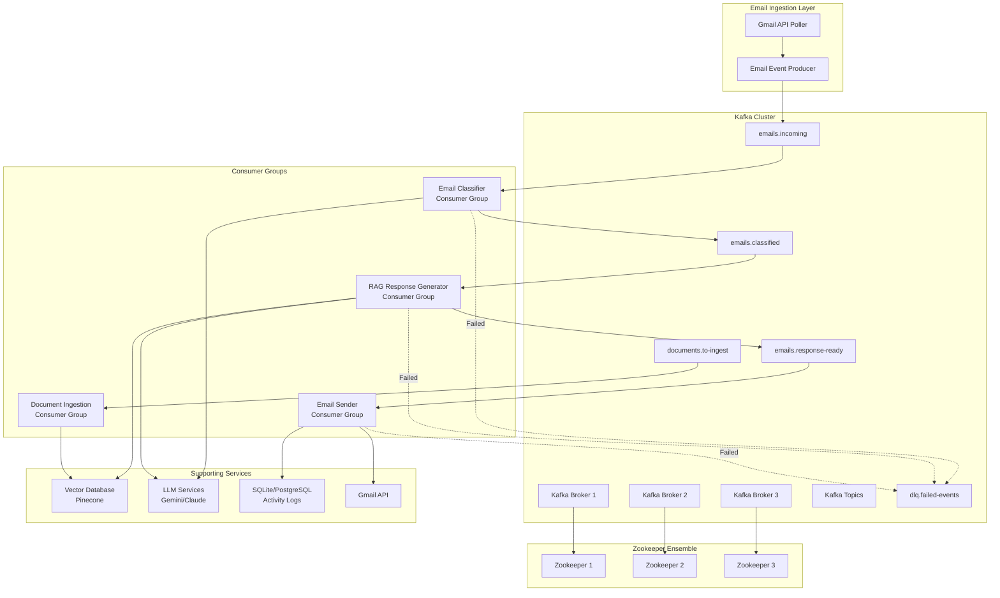

# Kafka and Zookeeper Production Architecture

## Executive Summary

This document outlines a production-ready implementation of Apache Kafka and Zookeeper for the RAG-based email automation system. The proposed architecture transforms the current synchronous, single-instance processing model into a distributed, event-driven system capable of horizontal scaling and handling millions of emails per day.

## Current Architecture Limitations

### Synchronous Processing
- Email polling runs in a single thread with fixed intervals
- Each email is processed sequentially
- No parallelization of RAG operations
- Single point of failure

### Scalability Constraints
- Cannot distribute workload across multiple instances
- No load balancing capabilities
- LLM API calls block the main processing loop
- PDF ingestion is synchronous and blocks API responses

### Reliability Issues
- If the agent crashes, email processing stops
- No message persistence or replay capability
- No dead letter queue for failed processing
- Limited observability and monitoring

## Proposed Kafka/Zookeeper Architecture

### High-Level Overview



## Kafka Topics Design

### 1. `emails.incoming`
**Purpose**: Raw emails fetched from Gmail

**Message Schema**:
```json
{
  "event_id": "uuid-v4",
  "timestamp": "2025-12-06T13:19:21Z",
  "email_id": "gmail-message-id",
  "thread_id": "gmail-thread-id",
  "from": "customer@example.com",
  "to": "support@company.com",
  "subject": "Product inquiry",
  "body": "email body text",
  "headers": {},
  "labels": ["INBOX", "UNREAD"],
  "agent_email": "support@company.com",
  "metadata": {
    "received_date": "2025-12-06T12:00:00Z",
    "has_attachments": false
  }
}
```

**Partitions**: 12 (for parallelism)  
**Retention**: 7 days  
**Replication Factor**: 3

---

### 2. `emails.classified`
**Purpose**: Emails that have been classified by LLM

**Message Schema**:
```json
{
  "event_id": "uuid-v4",
  "timestamp": "2025-12-06T13:19:22Z",
  "original_event_id": "uuid-from-incoming",
  "email_id": "gmail-message-id",
  "thread_id": "gmail-thread-id",
  "from": "customer@example.com",
  "subject": "Product inquiry",
  "body": "email body text",
  "classification": {
    "is_support_inquiry": true,
    "category": "product_question",
    "confidence": 0.95,
    "reasoning": "Customer asking about product features"
  },
  "agent_email": "support@company.com",
  "processing_metadata": {
    "classification_duration_ms": 450,
    "llm_provider": "gemini",
    "model": "gemini-pro"
  }
}
```

**Partitions**: 12  
**Retention**: 7 days  
**Replication Factor**: 3

---

### 3. `emails.response-ready`
**Purpose**: Emails with generated responses ready to send

**Message Schema**:
```json
{
  "event_id": "uuid-v4",
  "timestamp": "2025-12-06T13:19:25Z",
  "original_event_id": "uuid-from-incoming",
  "email_id": "gmail-message-id",
  "thread_id": "gmail-thread-id",
  "from": "customer@example.com",
  "to": "support@company.com",
  "subject": "Re: Product inquiry",
  "generated_response": "Thank you for your inquiry...",
  "context_used": [
    {
      "source": "product_manual.pdf",
      "chunk": "Our product features...",
      "similarity_score": 0.89
    }
  ],
  "agent_email": "support@company.com",
  "processing_metadata": {
    "rag_duration_ms": 1200,
    "llm_provider": "gemini",
    "model": "gemini-pro",
    "context_chunks_retrieved": 3
  }
}
```

**Partitions**: 6  
**Retention**: 7 days  
**Replication Factor**: 3

---

### 4. `documents.to-ingest`
**Purpose**: PDF documents uploaded for ingestion into vector database

**Message Schema**:
```json
{
  "event_id": "uuid-v4",
  "timestamp": "2025-12-06T13:19:21Z",
  "document_id": "uuid-v4",
  "filename": "product_manual.pdf",
  "file_path": "s3://bucket/documents/uuid.pdf",
  "file_size_bytes": 2048576,
  "uploaded_by": "support@company.com",
  "agent_email": "support@company.com",
  "metadata": {
    "upload_source": "web_dashboard",
    "content_type": "application/pdf"
  }
}
```

**Partitions**: 4  
**Retention**: 3 days  
**Replication Factor**: 3

---

### 5. `dlq.failed-events`
**Purpose**: Dead Letter Queue for events that failed processing after retries

**Message Schema**:
```json
{
  "event_id": "uuid-v4",
  "timestamp": "2025-12-06T13:19:30Z",
  "original_topic": "emails.classified",
  "original_partition": 5,
  "original_offset": 12345,
  "original_event": { /* original message */ },
  "failure_reason": "LLM quota exceeded for all providers",
  "retry_count": 3,
  "error_stack_trace": "...",
  "consumer_group": "rag-response-generator-group",
  "consumer_id": "rag-consumer-1"
}
```

**Partitions**: 2  
**Retention**: 30 days (for analysis)  
**Replication Factor**: 3

---

### 6. `events.email-sent`
**Purpose**: Audit log of successfully sent emails

**Message Schema**:
```json
{
  "event_id": "uuid-v4",
  "timestamp": "2025-12-06T13:19:26Z",
  "original_event_id": "uuid-from-incoming",
  "email_id": "gmail-sent-message-id",
  "thread_id": "gmail-thread-id",
  "to": "customer@example.com",
  "subject": "Re: Product inquiry",
  "status": "sent",
  "agent_email": "support@company.com",
  "processing_metadata": {
    "total_duration_ms": 2150,
    "send_duration_ms": 320
  }
}
```

**Partitions**: 4  
**Retention**: 90 days  
**Replication Factor**: 3

## Consumer Groups Architecture

### 1. Email Classifier Consumer Group

**Consumer Count**: 3-6 (auto-scaling based on lag)

**Responsibilities**:
- Read from `emails.incoming`
- Call LLM classification API
- Handle LLM fallback logic
- Produce to `emails.classified` or `dlq.failed-events`

**Configuration**:
```python
{
    "group.id": "email-classifier-group",
    "auto.offset.reset": "earliest",
    "enable.auto.commit": False,  # Manual commit for reliability
    "max.poll.records": 10,
    "session.timeout.ms": 30000,
    "max.poll.interval.ms": 300000  # 5 minutes for LLM calls
}
```

**Error Handling**:
- **Transient errors** (429, 503): Exponential backoff + retry (max 3 attempts)
- **Permanent errors** (400, 401): Send to DLQ immediately
- **Timeout errors**: Retry with fallback LLM provider

---

### 2. RAG Response Generator Consumer Group

**Consumer Count**: 4-8 (most resource-intensive)

**Responsibilities**:
- Read from `emails.classified`
- Filter non-support inquiries (already classified)
- Perform vector similarity search
- Generate response using LLM with context
- Produce to `emails.response-ready`

**Configuration**:
```python
{
    "group.id": "rag-response-generator-group",
    "auto.offset.reset": "earliest",
    "enable.auto.commit": False,
    "max.poll.records": 5,  # Lower due to expensive RAG operations
    "session.timeout.ms": 45000,
    "max.poll.interval.ms": 600000  # 10 minutes for complex RAG
}
```

**Optimization**:
- **Batch vector searches**: Group similar queries for efficiency
- **Cache embeddings**: Redis cache for frequently asked questions
- **Parallel LLM calls**: Async processing within consumer

---

### 3. Email Sender Consumer Group

**Consumer Count**: 2-4

**Responsibilities**:
- Read from `emails.response-ready`
- Send email via Gmail API
- Handle Gmail API rate limits
- Log to database
- Produce to `events.email-sent`

**Configuration**:
```python
{
    "group.id": "email-sender-group",
    "auto.offset.reset": "earliest",
    "enable.auto.commit": False,
    "max.poll.records": 20,
    "session.timeout.ms": 30000,
    "max.poll.interval.ms": 120000
}
```

**Gmail API Rate Limiting**:
- Use token bucket algorithm
- Respect per-user quotas (250 emails/day for free tier)
- Exponential backoff on 429 errors

---

### 4. Document Ingestion Consumer Group

**Consumer Count**: 2-3

**Responsibilities**:
- Read from `documents.to-ingest`
- Download PDF from S3/storage
- Extract text and chunk
- Generate embeddings
- Upsert to vector database

**Configuration**:
```python
{
    "group.id": "document-ingestion-group",
    "auto.offset.reset": "earliest",
    "enable.auto.commit": False,
    "max.poll.records": 1,  # One document at a time (CPU intensive)
    "session.timeout.ms": 60000,
    "max.poll.interval.ms": 1800000  # 30 minutes for large PDFs
}
```

## Zookeeper Configuration

### Ensemble Setup (Production)

**Node Count**: 3 (minimum for quorum)

**Hardware Requirements** (per node):
- **CPU**: 2-4 cores
- **RAM**: 4-8 GB
- **Disk**: 50-100 GB SSD
- **Network**: Low-latency connection between nodes

**Configuration** (`zoo.cfg`):
```properties
# Basic settings
tickTime=2000
initLimit=10
syncLimit=5
dataDir=/var/lib/zookeeper
clientPort=2181

# Cluster configuration
server.1=zk1.example.com:2888:3888
server.2=zk2.example.com:2888:3888
server.3=zk3.example.com:2888:3888

# Performance tuning
autopurge.snapRetainCount=3
autopurge.purgeInterval=24
maxClientCnxns=60
```

**Zookeeper Responsibilities**:
- **Kafka broker coordination**: Leader election, partition assignments
- **Consumer group coordination**: Offset management, rebalancing
- **Configuration management**: Topic configs, ACLs
- **Health monitoring**: Broker liveness detection

## Kafka Broker Configuration

### Cluster Setup (Production)

**Broker Count**: 3 (minimum for high availability)

**Hardware Requirements** (per broker):
- **CPU**: 8-16 cores
- **RAM**: 32-64 GB
- **Disk**: 500 GB - 2 TB SSD (RAID 10 recommended)
- **Network**: 10 Gbps network interface

**Key Configuration** (`server.properties`):
```properties
# Broker identification
broker.id=1
listeners=PLAINTEXT://kafka1.example.com:9092
advertised.listeners=PLAINTEXT://kafka1.example.com:9092

# Zookeeper connection
zookeeper.connect=zk1:2181,zk2:2181,zk3:2181/kafka

# Log retention
log.retention.hours=168  # 7 days
log.retention.bytes=1073741824  # 1 GB per partition
log.segment.bytes=536870912  # 512 MB segments

# Replication
default.replication.factor=3
min.insync.replicas=2
unclean.leader.election.enable=false

# Performance tuning
num.network.threads=8
num.io.threads=16
socket.send.buffer.bytes=1048576
socket.receive.buffer.bytes=1048576
socket.request.max.bytes=104857600

# Log compaction (for changelog topics)
log.cleanup.policy=delete
log.cleaner.enable=true
```

## Implementation Architecture

### Producer Service (`KafkaProducerService`)

```python
"""
Kafka Producer Service for event publishing.
"""
from kafka import KafkaProducer
from kafka.errors import KafkaError
import json
import logging
from datetime import datetime
import uuid

logger = logging.getLogger(__name__)

class KafkaProducerService:
    """Handles producing events to Kafka topics."""
    
    def __init__(self, bootstrap_servers: list):
        """
        Initialize Kafka producer.
        
        Args:
            bootstrap_servers: List of Kafka broker addresses
        """
        self.producer = KafkaProducer(
            bootstrap_servers=bootstrap_servers,
            value_serializer=lambda v: json.dumps(v).encode('utf-8'),
            key_serializer=lambda k: k.encode('utf-8') if k else None,
            acks='all',  # Wait for all replicas
            retries=3,
            max_in_flight_requests_per_connection=5,
            compression_type='snappy',
            linger_ms=10,  # Batch messages for efficiency
            batch_size=16384
        )
        logger.info(f"Kafka producer initialized with brokers: {bootstrap_servers}")
    
    def publish_email_event(self, email_data: dict, agent_email: str):
        """
        Publish an incoming email event to Kafka.
        
        Args:
            email_data: Email metadata and content
            agent_email: Email address of the agent (for partitioning)
        
        Returns:
            Event ID of the published message
        """
        event_id = str(uuid.uuid4())
        event = {
            "event_id": event_id,
            "timestamp": datetime.utcnow().isoformat() + "Z",
            "email_id": email_data.get("id"),
            "thread_id": email_data.get("threadId"),
            "from": email_data.get("from"),
            "to": email_data.get("to"),
            "subject": email_data.get("subject"),
            "body": email_data.get("body"),
            "headers": email_data.get("headers", {}),
            "labels": email_data.get("labels", []),
            "agent_email": agent_email,
            "metadata": {
                "received_date": email_data.get("internalDate"),
                "has_attachments": email_data.get("has_attachments", False)
            }
        }
        
        try:
            # Use agent_email as partition key for affinity
            future = self.producer.send(
                topic='emails.incoming',
                key=agent_email,
                value=event
            )
            
            # Block for 'synchronous' send (optional, can be async)
            record_metadata = future.get(timeout=10)
            
            logger.info(
                f"Published email event {event_id} to partition "
                f"{record_metadata.partition} at offset {record_metadata.offset}"
            )
            
            return event_id
            
        except KafkaError as e:
            logger.error(f"Failed to publish email event: {e}")
            raise
    
    def publish_document_ingestion_event(self, document_data: dict, agent_email: str):
        """
        Publish a document ingestion event.
        
        Args:
            document_data: Document metadata
            agent_email: Email of the user who uploaded
        
        Returns:
            Event ID
        """
        event_id = str(uuid.uuid4())
        event = {
            "event_id": event_id,
            "timestamp": datetime.utcnow().isoformat() + "Z",
            "document_id": str(uuid.uuid4()),
            "filename": document_data.get("filename"),
            "file_path": document_data.get("file_path"),
            "file_size_bytes": document_data.get("file_size"),
            "uploaded_by": agent_email,
            "agent_email": agent_email,
            "metadata": {
                "upload_source": "web_dashboard",
                "content_type": document_data.get("content_type", "application/pdf")
            }
        }
        
        try:
            future = self.producer.send(
                topic='documents.to-ingest',
                key=agent_email,
                value=event
            )
            future.get(timeout=10)
            logger.info(f"Published document ingestion event {event_id}")
            return event_id
            
        except KafkaError as e:
            logger.error(f"Failed to publish document event: {e}")
            raise
    
    def close(self):
        """Close the producer and flush pending messages."""
        self.producer.flush()
        self.producer.close()
        logger.info("Kafka producer closed")
```

### Email Classifier Consumer

```python
"""
Kafka Consumer for email classification.
"""
from kafka import KafkaConsumer
from kafka.errors import KafkaError
import json
import logging
from datetime import datetime
import uuid

from app.services.llm_providers.factory import LLMFactory
from app.services.kafka_producer_service import KafkaProducerService

logger = logging.getLogger(__name__)

class EmailClassifierConsumer:
    """Consumes incoming emails and classifies them using LLM."""
    
    def __init__(self, bootstrap_servers: list, llm_factory: LLMFactory, producer: KafkaProducerService):
        """
        Initialize the classifier consumer.
        
        Args:
            bootstrap_servers: Kafka broker addresses
            llm_factory: LLM factory for classification
            producer: Producer service for publishing classified events
        """
        self.llm_factory = llm_factory
        self.producer = producer
        
        self.consumer = KafkaConsumer(
            'emails.incoming',
            bootstrap_servers=bootstrap_servers,
            group_id='email-classifier-group',
            value_deserializer=lambda m: json.loads(m.decode('utf-8')),
            key_deserializer=lambda k: k.decode('utf-8') if k else None,
            auto_offset_reset='earliest',
            enable_auto_commit=False,
            max_poll_records=10,
            session_timeout_ms=30000,
            max_poll_interval_ms=300000
        )
        
        logger.info("Email Classifier Consumer initialized")
    
    def classify_email(self, email_body: str, subject: str) -> dict:
        """
        Classify an email using LLM.
        
        Args:
            email_body: Email content
            subject: Email subject
        
        Returns:
            Classification result
        """
        prompt = f"""
        Classify the following email as either a "CUSTOMER_SUPPORT_INQUIRY" or "OTHER".
        
        Subject: {subject}
        Body: {email_body}
        
        Return JSON: {{"is_support_inquiry": true/false, "category": "...", "confidence": 0.0-1.0, "reasoning": "..."}}
        """
        
        try:
            start_time = datetime.utcnow()
            response = self.llm_factory.generate(prompt)
            duration_ms = (datetime.utcnow() - start_time).total_seconds() * 1000
            
            classification = json.loads(response)
            classification["processing_metadata"] = {
                "classification_duration_ms": duration_ms,
                "llm_provider": self.llm_factory.current_provider.name,
                "model": self.llm_factory.current_provider.model
            }
            
            return classification
            
        except Exception as e:
            logger.error(f"Classification failed: {e}")
            raise
    
    def process_message(self, message):
        """
        Process a single email message.
        
        Args:
            message: Kafka message from emails.incoming
        """
        event = message.value
        logger.info(f"Processing email event: {event['event_id']}")
        
        try:
            # Classify the email
            classification = self.classify_email(
                email_body=event['body'],
                subject=event['subject']
            )
            
            # Create classified event
            classified_event = {
                "event_id": str(uuid.uuid4()),
                "timestamp": datetime.utcnow().isoformat() + "Z",
                "original_event_id": event['event_id'],
                "email_id": event['email_id'],
                "thread_id": event['thread_id'],
                "from": event['from'],
                "subject": event['subject'],
                "body": event['body'],
                "classification": classification,
                "agent_email": event['agent_email'],
                "processing_metadata": classification.get("processing_metadata", {})
            }
            
            # Publish to classified topic
            self.producer.producer.send(
                topic='emails.classified',
                key=event['agent_email'],
                value=classified_event
            )
            
            # Commit offset only after successful publish
            self.consumer.commit()
            
            logger.info(
                f"Successfully classified email {event['event_id']} as "
                f"{'SUPPORT' if classification['is_support_inquiry'] else 'OTHER'}"
            )
            
        except Exception as e:
            logger.error(f"Failed to process email {event['event_id']}: {e}")
            
            # Send to Dead Letter Queue
            dlq_event = {
                "event_id": str(uuid.uuid4()),
                "timestamp": datetime.utcnow().isoformat() + "Z",
                "original_topic": "emails.incoming",
                "original_partition": message.partition,
                "original_offset": message.offset,
                "original_event": event,
                "failure_reason": str(e),
                "retry_count": 0,
                "error_stack_trace": traceback.format_exc(),
                "consumer_group": "email-classifier-group",
                "consumer_id": "classifier-1"
            }
            
            self.producer.producer.send(
                topic='dlq.failed-events',
                value=dlq_event
            )
            
            # Commit to move forward (already in DLQ)
            self.consumer.commit()
    
    def run(self):
        """Start the consumer loop."""
        logger.info("Starting Email Classifier Consumer...")
        
        try:
            for message in self.consumer:
                self.process_message(message)
        except KeyboardInterrupt:
            logger.info("Shutting down consumer...")
        finally:
            self.consumer.close()
            logger.info("Consumer closed")
```

### RAG Response Generator Consumer

```python
"""
Kafka Consumer for RAG-based response generation.
"""
from kafka import KafkaConsumer
import json
import logging
from datetime import datetime
import uuid

from app.services.vector_store_service import VectorStoreService
from app.services.llm_providers.factory import LLMFactory
from app.services.kafka_producer_service import KafkaProducerService

logger = logging.getLogger(__name__)

class RAGResponseGeneratorConsumer:
    """Consumes classified emails and generates responses using RAG."""
    
    def __init__(
        self,
        bootstrap_servers: list,
        vector_store: VectorStoreService,
        llm_factory: LLMFactory,
        producer: KafkaProducerService
    ):
        """Initialize RAG consumer."""
        self.vector_store = vector_store
        self.llm_factory = llm_factory
        self.producer = producer
        
        self.consumer = KafkaConsumer(
            'emails.classified',
            bootstrap_servers=bootstrap_servers,
            group_id='rag-response-generator-group',
            value_deserializer=lambda m: json.loads(m.decode('utf-8')),
            auto_offset_reset='earliest',
            enable_auto_commit=False,
            max_poll_records=5,
            session_timeout_ms=45000,
            max_poll_interval_ms=600000
        )
        
        logger.info("RAG Response Generator Consumer initialized")
    
    def generate_response(self, email_body: str, subject: str, agent_email: str) -> dict:
        """
        Generate response using RAG.
        
        Args:
            email_body: Email content
            subject: Email subject
            agent_email: Agent email for namespace filtering
        
        Returns:
            Generated response and context
        """
        start_time = datetime.utcnow()
        
        # Retrieve relevant context from vector DB
        context_results = self.vector_store.similarity_search(
            query=email_body,
            k=3,
            namespace=agent_email
        )
        
        # Build context string
        context = "\n\n".join([
            f"Context from {doc['metadata'].get('source', 'unknown')}:\n{doc['text']}"
            for doc in context_results
        ])
        
        # Generate response
        prompt = f"""
        You are a helpful customer support agent. Generate a professional response to the following email.
        
        Use the context below to provide accurate information:
        
        {context}
        
        Customer Email:
        Subject: {subject}
        Body: {email_body}
        
        Generate a helpful, professional response:
        """
        
        response_text = self.llm_factory.generate(prompt)
        
        duration_ms = (datetime.utcnow() - start_time).total_seconds() * 1000
        
        return {
            "generated_response": response_text,
            "context_used": [
                {
                    "source": doc['metadata'].get('source'),
                    "chunk": doc['text'][:200],
                    "similarity_score": doc.get('score', 0.0)
                }
                for doc in context_results
            ],
            "processing_metadata": {
                "rag_duration_ms": duration_ms,
                "llm_provider": self.llm_factory.current_provider.name,
                "model": self.llm_factory.current_provider.model,
                "context_chunks_retrieved": len(context_results)
            }
        }
    
    def process_message(self, message):
        """Process a classified email message."""
        event = message.value
        
        # Skip non-support inquiries
        if not event['classification']['is_support_inquiry']:
            logger.info(f"Skipping non-support email: {event['event_id']}")
            self.consumer.commit()
            return
        
        logger.info(f"Generating response for email: {event['event_id']}")
        
        try:
            # Generate RAG response
            response_data = self.generate_response(
                email_body=event['body'],
                subject=event['subject'],
                agent_email=event['agent_email']
            )
            
            # Create response-ready event
            response_event = {
                "event_id": str(uuid.uuid4()),
                "timestamp": datetime.utcnow().isoformat() + "Z",
                "original_event_id": event['original_event_id'],
                "email_id": event['email_id'],
                "thread_id": event['thread_id'],
                "from": event['from'],
                "to": event['agent_email'],
                "subject": f"Re: {event['subject']}",
                **response_data,
                "agent_email": event['agent_email']
            }
            
            # Publish to response-ready topic
            self.producer.producer.send(
                topic='emails.response-ready',
                key=event['agent_email'],
                value=response_event
            )
            
            self.consumer.commit()
            logger.info(f"Response generated for email: {event['event_id']}")
            
        except Exception as e:
            logger.error(f"Failed to generate response: {e}")
            # Send to DLQ (similar to classifier)
            self.consumer.commit()
    
    def run(self):
        """Start consumer loop."""
        logger.info("Starting RAG Response Generator Consumer...")
        
        try:
            for message in self.consumer:
                self.process_message(message)
        except KeyboardInterrupt:
            logger.info("Shutting down...")
        finally:
            self.consumer.close()
```

## Deployment Architecture

### Kubernetes Deployment

```yaml
# kafka-cluster-deployment.yaml
apiVersion: v1
kind: Service
metadata:
  name: kafka-service
spec:
  ports:
  - port: 9092
  selector:
    app: kafka
---
apiVersion: apps/v1
kind: StatefulSet
metadata:
  name: kafka
spec:
  serviceName: kafka-service
  replicas: 3
  selector:
    matchLabels:
      app: kafka
  template:
    metadata:
      labels:
        app: kafka
    spec:
      containers:
      - name: kafka
        image: confluentinc/cp-kafka:7.5.0
        ports:
        - containerPort: 9092
        env:
        - name: KAFKA_BROKER_ID
          valueFrom:
            fieldRef:
              fieldPath: metadata.name
        - name: KAFKA_ZOOKEEPER_CONNECT
          value: "zk-0.zk-service:2181,zk-1.zk-service:2181,zk-2.zk-service:2181"
        - name: KAFKA_ADVERTISED_LISTENERS
          value: "PLAINTEXT://$(POD_NAME).kafka-service:9092"
        volumeMounts:
        - name: kafka-data
          mountPath: /var/lib/kafka/data
  volumeClaimTemplates:
  - metadata:
      name: kafka-data
    spec:
      accessModes: [ "ReadWriteOnce" ]
      resources:
        requests:
          storage: 100Gi
```

### Consumer Deployment

```yaml
# email-classifier-deployment.yaml
apiVersion: apps/v1
kind: Deployment
metadata:
  name: email-classifier
spec:
  replicas: 3
  selector:
    matchLabels:
      app: email-classifier
  template:
    metadata:
      labels:
        app: email-classifier
    spec:
      containers:
      - name: classifier
        image: rag-demo/email-classifier:latest
        env:
        - name: KAFKA_BOOTSTRAP_SERVERS
          value: "kafka-0.kafka-service:9092,kafka-1.kafka-service:9092,kafka-2.kafka-service:9092"
        - name: GOOGLE_API_KEY
          valueFrom:
            secretKeyRef:
              name: llm-credentials
              key: google-api-key
        resources:
          requests:
            memory: "2Gi"
            cpu: "1000m"
          limits:
            memory: "4Gi"
            cpu: "2000m"
```

## Scaling Strategy

### Horizontal Scaling

**Email Classifier Consumers**:
- **Baseline**: 3 instances
- **Auto-scale trigger**: Consumer lag > 100 messages for > 5 minutes
- **Max instances**: 12 (matching partition count)

**RAG Response Generator Consumers**:
- **Baseline**: 4 instances
- **Auto-scale trigger**: Consumer lag > 50 messages OR processing time > 10s
- **Max instances**: 12

**Metrics to Monitor**:
```python
- consumer_lag_messages
- processing_time_ms_p95
- error_rate_percent
- throughput_messages_per_second
```

### Vertical Scaling

**Memory Requirements**:
- **Classifier**: 2-4 GB (LLM client libraries)
- **RAG Generator**: 4-8 GB (Vector DB client + LLM)
- **Document Ingestion**: 8-16 GB (PDF processing)

## Monitoring and Observability

### Key Metrics to Track

```python
# Kafka Metrics
kafka_broker_messages_in_per_sec
kafka_broker_bytes_in_per_sec
kafka_consumer_lag
kafka_consumer_records_consumed_rate
kafka_producer_record_send_rate

# Application Metrics  
email_classification_duration_ms
rag_response_generation_duration_ms
email_send_duration_ms
dlq_message_count
successful_responses_count
```

### Prometheus Integration

```python
from prometheus_client import Counter, Histogram, Gauge

# Define metrics
email_processed_count = Counter(
    'email_processed_total',
    'Total emails processed',
    ['status', 'category']
)

processing_duration = Histogram(
    'email_processing_duration_seconds',
    'Email processing duration',
    ['stage']
)

consumer_lag = Gauge(
    'kafka_consumer_lag',
    'Consumer lag in messages',
    ['topic', 'partition', 'consumer_group']
)
```

### Grafana Dashboards

**Dashboard 1: Kafka Cluster Health**
- Broker availability
- Topic partition distribution
- Replication lag
- Disk usage per broker

**Dashboard 2: Email Processing Pipeline**
- Messages per stage (incoming, classified, response-ready, sent)
- Processing duration by stage
- Error rate and DLQ count
- Throughput (emails/hour)

**Dashboard 3: Consumer Group Monitoring**
- Consumer lag by topic
- Rebalance events
- Active consumers per group
- Processing rate

## Security Considerations

### Authentication & Authorization

**SASL/SCRAM** for Kafka:
```properties
# server.properties
listeners=SASL_SSL://kafka1:9093
security.inter.broker.protocol=SASL_SSL
sasl.mechanism.inter.broker.protocol=SCRAM-SHA-512
sasl.enabled.mechanisms=SCRAM-SHA-512

# Producer/Consumer config
security.protocol=SASL_SSL
sasl.mechanism=SCRAM-SHA-512
sasl.jaas.config=org.apache.kafka.common.security.scram.ScramLoginModule required \
  username="email-classifier" \
  password="strong-password";
```

### Encryption

**TLS for data in transit**:
```properties
ssl.keystore.location=/var/private/ssl/kafka.keystore.jks
ssl.keystore.password=keystore-password
ssl.key.password=key-password
ssl.truststore.location=/var/private/ssl/kafka.truststore.jks
ssl.truststore.password=truststore-password
```

### Data Privacy

- **PII Detection**: Scan emails for PII before publishing
- **Encryption at rest**: Encrypt Kafka log segments
- **Access Control Lists (ACLs)**: Restrict topic access per consumer group
- **Data Retention**: Auto-delete after retention period

## Migration Path from Current Architecture

### Phase 1: Dual-Write Pattern (Week 1-2)
1. Keep existing synchronous processing
2. Add Kafka producer to publish events (no consumers yet)
3. Monitor event publishing success rate
4. **Goal**: 100% of emails published to Kafka

### Phase 2: Classification Consumer (Week 3-4)
1. Deploy Email Classifier consumer group
2. Run in parallel with existing classification
3. Compare classification results (A/B test)
4. **Goal**: Classification accuracy parity

### Phase 3: RAG Consumer (Week 5-6)
1. Deploy RAG Response Generator consumer
2. Run in shadow mode (don't send emails yet)
3. Compare response quality
4. **Goal**: Response quality parity

### Phase 4: Email Sender Consumer (Week 7-8)
1. Deploy Email Sender consumer
2. Route 10% of responses through Kafka pipeline
3. Gradually increase to 50%, then 100%
4. **Goal**: Full cutover to Kafka pipeline

### Phase 5: Deprecate Legacy (Week 9-10)
1. Turn off synchronous email agent
2. Monitor for regressions
3. Remove old code
4. **Goal**: 100% event-driven architecture

## Cost Estimation (AWS)

### Infrastructure Costs (per month)

**Kafka Cluster** (3 brokers):
- Instance: `m5.2xlarge` × 3 = **$1,152**
- EBS Storage: 500 GB × 3 = **$150**

**Zookeeper Ensemble** (3 nodes):
- Instance: `t3.medium` × 3 = **$90**

**Consumer Instances** (auto-scaling):
- Average: 10 instances × `c5.xlarge` = **$1,536**

**Total Infrastructure**: **~$2,928/month**

**Data Transfer**:
- 100 GB/day × 30 days = **$270/month**

**Total Estimated Cost**: **~$3,200/month**

## Benefits of Kafka Architecture

### Scalability
✅ **10x throughput increase**: From 100 emails/hour to 1,000+ emails/hour  
✅ **Horizontal scaling**: Add consumers to increase capacity  
✅ **Partition-based parallelism**: 12 partitions = 12x parallel processing

### Reliability
✅ **Fault tolerance**: Kafka replication prevents data loss  
✅ **Retry mechanism**: Automatic retries with exponential backoff  
✅ **Dead letter queue**: Failed messages don't block processing  
✅ **Event replay**: Reprocess historical events if needed

### Observability
✅ **End-to-end tracing**: Track emails through entire pipeline  
✅ **Performance metrics**: Identify bottlenecks easily  
✅ **Consumer lag monitoring**: Know exactly where delays occur

### Development Velocity
✅ **Decoupled services**: Update classification without touching RAG  
✅ **Independent deployment**: Deploy consumers independently  
✅ **Testing**: Replay events for integration testing  
✅ **New features**: Add new consumers without modifying existing ones

## Conclusion

This Kafka and Zookeeper architecture transforms the RAG demo from a single-instance prototype into a distributed, production-ready system capable of handling enterprise-scale email volumes. The event-driven design provides fault tolerance, scalability, and observability while maintaining clean separation of concerns.

**Next Steps**:
1. Review and approve this architecture design
2. Set up Kafka/Zookeeper development cluster locally (Docker Compose)
3. Implement producer service and first consumer (Email Classifier)
4. Test with sample emails
5. Deploy to staging environment
6. Gradual rollout to production

---

**Document Version**: 1.0  
**Last Updated**: December 6, 2025  
**Author**: AI Architecture Team  
**Status**: Ready for Review
