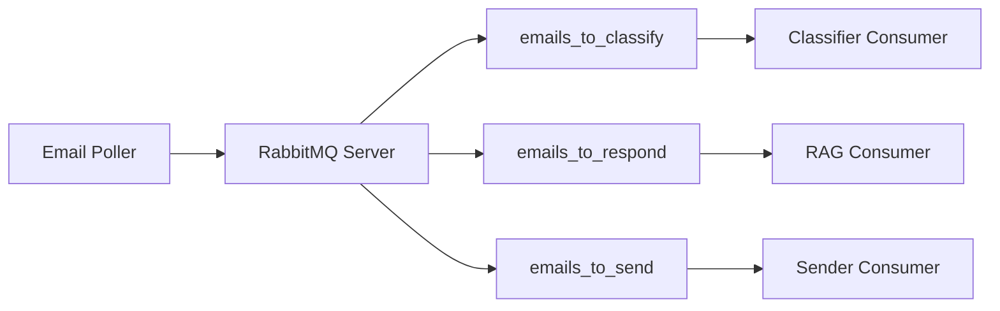
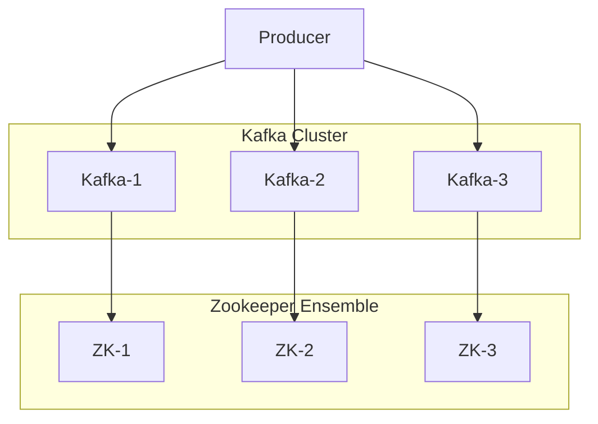
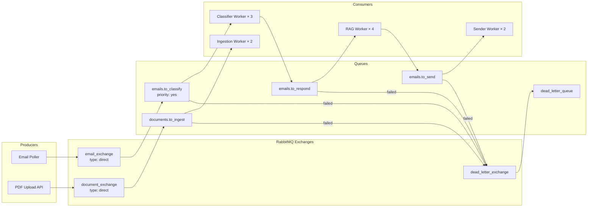

# Message Queue Evaluation: RabbitMQ vs Kafka

## Executive Summary

This document provides a comprehensive comparison between **RabbitMQ** and **Kafka + Zookeeper** for the RAG-based email automation system, evaluating both options against the project's specific requirements.

**Recommendation**: **RabbitMQ** is the better choice for this project due to lower operational complexity, easier local development, and sufficient scalability for the expected workload.

---

## Quick Comparison Table

| Factor | RabbitMQ | Kafka + Zookeeper | Winner |
|--------|----------|-------------------|--------|
| **Operational Complexity** | Low (1 service) | High (6+ services) | 🏆 RabbitMQ |
| **Setup Time** | 15 minutes | 2-4 hours | 🏆 RabbitMQ |
| **Memory Footprint** | 512 MB - 2 GB | 8-16 GB (cluster) | 🏆 RabbitMQ |
| **Learning Curve** | Gentle | Steep | 🏆 RabbitMQ |
| **Max Throughput** | ~50K msgs/sec | ~1M msgs/sec | Kafka |
| **Message Ordering** | Per queue | Per partition | Tie |
| **Built-in UI** | ✅ Excellent | ❌ Need Kafdrop | 🏆 RabbitMQ |
| **Event Replay** | ❌ Limited | ✅ Excellent | Kafka |
| **Use Case Fit** | Task queues, RPC | Event streaming, logs | 🏆 RabbitMQ |
| **Production Maturity** | ✅ Mature | ✅ Mature | Tie |

**Score**: RabbitMQ 7, Kafka 3, Tie 2

---

## Use Case Analysis

### Current Requirements

**Email Volume**:
- Expected: 100-500 emails/day
- Peak: 1,000 emails/day
- Target throughput: ~1-10 emails/minute

**Processing Pattern**:
- Sequential pipeline: Classify → RAG → Send
- Each stage waits for previous stage
- No need for event replay or historical processing
- Need: Reliable task queue with retry logic

**Operational Constraints**:
- Small team (1-3 developers)
- Limited DevOps expertise
- Prefer simple local development
- Cost-conscious (minimize infrastructure)

### Architecture Pattern Match

#### RabbitMQ: Task Queue Pattern ✅

RabbitMQ excels at the **task queue pattern** where:
- Messages represent work items (emails to process)
- Consumers process tasks and acknowledge completion
- Failed tasks retry automatically
- FIFO ordering per queue

**Perfect fit** for email processing workflow.

#### Kafka: Event Streaming Pattern ⚠️

Kafka excels at the **event streaming pattern** where:
- Messages represent historical events
- Multiple consumers read same events
- Event replay needed for analytics
- Append-only log with persistence

**Overkill** for simple email processing pipeline.

---

## Detailed Comparison

### 1. Operational Complexity

#### RabbitMQ

**Architecture**:


**Components**: 1 service (RabbitMQ)

**Docker Compose**:
```yaml
services:
  rabbitmq:
    image: rabbitmq:3-management
    ports:
      - "5672:5672"    # AMQP
      - "15672:15672"  # Management UI
```

**Setup time**: 5 minutes

**Operational burden**: Low
- Single service to monitor
- Built-in management UI
- Auto-restart on failure

---

#### Kafka + Zookeeper

**Architecture**:


**Components**: 6 services minimum (3 Kafka + 3 Zookeeper)

**Docker Compose**: 200+ lines of configuration

**Setup time**: 2-4 hours (including troubleshooting)

**Operational burden**: High
- Monitor 6+ services
- Coordinate Zookeeper quorum
- Manage partition assignments
- Need separate UI (Kafdrop)
- Complex failure scenarios

---

### 2. Throughput and Scalability

#### Current Needs

- **Email volume**: 1,000 emails/day = **0.7 emails/minute**
- **Processing time**: ~2-5 seconds per email
- **Required throughput**: 10-50 messages/minute

#### RabbitMQ Capacity

- **Throughput**: 10,000-50,000 messages/second
- **Your usage**: ~1 message/minute
- **Headroom**: **99.9% unused capacity** ✅

**Scaling**:
- Add more consumers (horizontal scale consumers)
- Single RabbitMQ instance handles 100K+ msgs/sec
- Cluster RabbitMQ only if you exceed 100K emails/day

#### Kafka Capacity

- **Throughput**: 1,000,000+ messages/second
- **Your usage**: ~1 message/minute
- **Headroom**: **99.99% unused capacity** (overkill)

**When Kafka makes sense**:
- 10M+ messages/day
- Multiple independent consumers of same events
- Need event replay for analytics
- Log aggregation across 100+ services

---

### 3. Development Experience

#### RabbitMQ

**Local Setup**:
```bash
# Start RabbitMQ
docker run -d -p 5672:5672 -p 15672:15672 rabbitmq:3-management

# Access UI: http://localhost:15672 (guest/guest)
# Ready in 30 seconds!
```

**Python Code** (Producer):
```python
import pika

connection = pika.BlockingConnection(pika.ConnectionParameters('localhost'))
channel = connection.channel()

channel.queue_declare(queue='emails_to_classify', durable=True)

channel.basic_publish(
    exchange='',
    routing_key='emails_to_classify',
    body=json.dumps(email_data),
    properties=pika.BasicProperties(delivery_mode=2)  # persistent
)
```

**Python Code** (Consumer):
```python
def callback(ch, method, properties, body):
    email = json.loads(body)
    try:
        # Process email
        classify_email(email)
        ch.basic_ack(delivery_tag=method.delivery_tag)
    except Exception as e:
        # Reject and requeue
        ch.basic_nack(delivery_tag=method.delivery_tag, requeue=True)

channel.basic_consume(queue='emails_to_classify', on_message_callback=callback)
channel.start_consuming()
```

**Development Time**: 30 minutes to integrate

---

#### Kafka

**Local Setup**:
```bash
# Start Zookeeper ensemble (3 nodes)
docker-compose -f docker-compose.kafka.yml up -d

# Wait 2-3 minutes for cluster formation
# Manually create topics
# Configure partitions and replication
# Install kafdrop for UI
# Debug connection issues
```

**Python Code** (Producer):
```python
from kafka import KafkaProducer

producer = KafkaProducer(
    bootstrap_servers=['localhost:19092', 'localhost:19093', 'localhost:19094'],
    value_serializer=lambda v: json.dumps(v).encode('utf-8'),
    acks='all',
    retries=3
)

producer.send('emails.incoming', value=email_data, key=agent_email)
producer.flush()
```

**Python Code** (Consumer):
```python
from kafka import KafkaConsumer

consumer = KafkaConsumer(
    'emails.incoming',
    bootstrap_servers=['localhost:19092', 'localhost:19093', 'localhost:19094'],
    group_id='email-classifier-group',
    auto_offset_reset='earliest',
    enable_auto_commit=False,
    value_deserializer=lambda m: json.loads(m.decode('utf-8'))
)

for message in consumer:
    try:
        process_email(message.value)
        consumer.commit()
    except Exception as e:
        # Manual DLQ handling
        send_to_dlq(message.value, str(e))
```

**Development Time**: 4-8 hours to integrate properly

---

### 4. Feature Comparison

#### Message Acknowledgment

**RabbitMQ**: Built-in with `basic_ack` / `basic_nack`
- Automatic requeue on failure
- Dead letter exchange for poison messages
- Simple and reliable

**Kafka**: Manual offset management
- Must track offsets yourself
- Build your own retry logic
- Build your own dead letter queue

**Winner**: 🏆 RabbitMQ

---

#### Message Priority

**RabbitMQ**: ✅ Native priority queues
- Priority 1-10 per message
- High-priority emails processed first

**Kafka**: ❌ No message priority
- Strict FIFO per partition
- Cannot prioritize urgent emails

**Winner**: 🏆 RabbitMQ

---

#### Message TTL (Time-to-Live)

**RabbitMQ**: ✅ Native TTL
- Per-message or per-queue TTL
- Auto-expire old messages

**Kafka**: ❌ Only retention policy
- Cannot expire individual messages
- Must process or skip manually

**Winner**: 🏆 RabbitMQ

---

#### Message Routing

**RabbitMQ**: ✅ Flexible routing
- Direct, topic, fanout, headers exchanges
- Route based on complex rules
- Example: Route emails by domain to different queues

**Kafka**: ❌ Topic-based only
- Must create separate topics
- Limited routing flexibility

**Winner**: 🏆 RabbitMQ

---

#### Event Replay

**RabbitMQ**: ❌ Limited
- Messages deleted after acknowledgment
- No historical replay

**Kafka**: ✅ Excellent
- Retain messages for days/weeks
- Replay from any offset
- Multiple consumers read same events

**Winner**: Kafka (but not needed for email processing)

---

#### Monitoring UI

**RabbitMQ**: ✅ Built-in Management UI
- Queues, connections, channels
- Message rates, throughput graphs  
- Publish/consume messages manually
- User management

**Kafka**: ❌ No built-in UI
- Need Kafdrop, Kafka UI, or Confluent Control Center
- Requires separate deployment
- Less feature-rich

**Winner**: 🏆 RabbitMQ

---

### 5. Cost Analysis

#### Local Development

**RabbitMQ**:
- **Memory**: 512 MB - 1 GB
- **CPU**: 0.5 cores
- **Disk**: 1-5 GB
- **Total Docker overhead**: ~1 GB RAM

**Kafka + Zookeeper**:
- **Memory**: 8-16 GB (3 brokers + 3 ZK + Kafdrop)
- **CPU**: 2-4 cores
- **Disk**: 20-50 GB
- **Total Docker overhead**: ~10 GB RAM

**Winner**: 🏆 RabbitMQ (10x less resource usage)

---

#### Production Cloud Costs (AWS)

**RabbitMQ** (Single instance):
- **Instance**: t3.medium (2 vCPU, 4 GB RAM) = $30/month
- **Storage**: 20 GB EBS = $2/month
- **Load Balancer**: Optional
- **Total**: **~$32/month**

**RabbitMQ** (HA Cluster, 3 nodes):
- **Instances**: t3.medium × 3 = $90/month
- **Storage**: 20 GB × 3 = $6/month
- **Load Balancer**: $18/month
- **Total**: **~$114/month**

**Kafka + Zookeeper** (Minimum HA):
- **Kafka brokers**: m5.large × 3 = $288/month
- **Zookeeper**: t3.medium × 3 = $90/month
- **Storage**: 100 GB × 3 = $30/month
- **Load Balancer**: $18/month
- **Total**: **~$426/month**

**Managed Kafka** (Amazon MSK):
- **Kafka.m5.large × 3**: $546/month
- **Storage**: 100 GB × 3 = $30/month
- **Data transfer**: Variable
- **Total**: **~$576/month**

**Managed RabbitMQ** (Amazon MQ):
- **mq.t3.micro × 2** (HA): $36/month
- **Storage**: 20 GB = $2/month
- **Total**: **~$38/month**

**Winner**: 🏆 RabbitMQ (10-15x cheaper)

---

### 6. Failure Scenarios

#### Broker Failure

**RabbitMQ** (Single instance):
- **Impact**: Messages lost if not persisted to disk
- **Recovery**: Restart, replay from last checkpoint
- **Solution**: Use durable queues + persistent messages

**RabbitMQ** (Cluster):
- **Impact**: Automatic failover to other nodes
- **Recovery**: Seamless (< 1 second)
- **Mirrored queues ensure no message loss**

**Kafka** (Cluster):
- **Impact**: Automatic leader election
- **Recovery**: Seamless (replication factor ≥ 2)
- **No message loss with proper configuration**

**Winner**: Tie (both reliable with proper setup)

---

#### Network Partition

**RabbitMQ**:
- **Behavior**: Depends on cluster partition handling mode
- **Default**: Pause minority partition (safe)
- **Recovery**: Manual intervention may be needed

**Kafka**:
- **Behavior**: Uses Zookeeper for quorum
- **Recovery**: Automatic leader election
- **More resilient to network partitions**

**Winner**: Kafka (better partition tolerance)

---

### 7. Learning Curve

#### RabbitMQ

**Concepts to learn**:
- ✅ Queues (simple FIFO buffers)
- ✅ Exchanges (routing logic)
- ✅ Bindings (exchange-to-queue mapping)
- ✅ Acknowledgments (confirm processing)

**Time to productivity**: **1-2 days**

**Debugging**: Easy (UI shows everything)

---

#### Kafka

**Concepts to learn**:
- ⚠️ Topics (logical channels)
- ⚠️ Partitions (parallelism units)
- ⚠️ Offsets (position tracking)
- ⚠️ Consumer groups (load balancing)
- ⚠️ Replication (fault tolerance)
- ⚠️ Zookeeper coordination
- ⚠️ Leader election
- ⚠️ ISR (in-sync replicas)

**Time to productivity**: **1-2 weeks**

**Debugging**: Moderate (CLI tools + UI)

**Winner**: 🏆 RabbitMQ (much gentler learning curve)

---

## When to Choose Kafka

Kafka is the better choice when you have:

### ✅ High Throughput Requirements
- **10M+ messages/day** (>115 msgs/sec sustained)
- **Peak loads** of 10K+ msgs/sec
- Multiple producers writing simultaneously

### ✅ Event Streaming Use Cases
- **Log aggregation** from 100+ services
- **Real-time analytics** pipelines
- **Change data capture** (CDC)
- **Activity tracking** across microservices

### ✅ Event Replay Requirements
- **Reprocess historical data** for ML model training
- **Multiple consumers** need to read same events
- **Time-travel debugging** (replay events from past)
- **Audit trails** requiring permanent event log

### ✅ Complex Event Processing
- **Stream joins** (combine multiple event streams)
- **Windowing operations** (aggregate events over time)
- **Event sourcing** architecture
- **CQRS patterns**

### ✅ Infrastructure Already Exists
- Team has Kafka expertise
- Kafka cluster already managed
- Other services use Kafka

---

## When to Choose RabbitMQ

RabbitMQ is the better choice when you have:

### ✅ Task Queue Requirements (Your Case!)
- **Work items** that need processing
- **Request-response patterns**
- **Job scheduling** and background workers
- **RPC-style** communication

### ✅ Low-to-Medium Throughput
- **< 1M messages/day**
- **< 10 msgs/sec** sustained

### ✅ Operational Simplicity Priority
- Small team
- Limited DevOps resources
- Need quick setup and easy maintenance

### ✅ Advanced Routing Needs
- **Priority queues**
- **Complex routing rules**
- **Message TTL**
- **Dead letter exchanges**

### ✅ Cost Constraints
- Need to minimize infrastructure costs
- Single instance sufficient
- Don't need high availability initially

---

## Recommendation for RAG Demo

### Choose RabbitMQ ✅

**Reasons**:

1. **Perfect Use Case Match**
   - Email processing is a classic task queue pattern
   - No need for event replay
   - Sequential pipeline: classify → respond → send

2. **Operational Simplicity**
   - 1 service vs 6+ services
   - 15-minute setup vs 2-4 hours
   - Built-in UI vs separate management tools

3. **Cost Efficiency**
   - $32/month vs $426/month (13x cheaper)
   - 1 GB RAM vs 10 GB RAM locally

4. **Development Velocity**
   - Integrate in 30 minutes vs 4-8 hours
   - Gentler learning curve
   - Easier debugging

5. **Sufficient Scalability**
   - Handles 50K msgs/sec (you need 1 msg/min)
   - 99.9% headroom for growth
   - Can upgrade to Kafka later if needed

6. **Feature Fit**
   - Message priority (urgent emails first)
   - TTL (expire old notifications)
   - Flexible routing (by domain, category, etc.)
   - Auto-retry with DLX

### Migration Path: Start with RabbitMQ, Upgrade if Needed

**Phase 1**: RabbitMQ (Month 1-12)
- Handle 1K-100K emails/day easily
- Simple ops, low cost
- Fast development

**Phase 2**: Evaluate Kafka (Month 12+)
- If volume exceeds 100K emails/day
- If you need event replay for analytics
- If you add stream processing features

**Migration**: Use dual-write pattern
- Publish to both RabbitMQ and Kafka
- Gradually move consumers to Kafka
- Turn off RabbitMQ once validated

---

## Proposed RabbitMQ Architecture

### Queue Design



### Queue Configuration

**emails.to_classify**:
```python
channel.queue_declare(
    queue='emails.to_classify',
    durable=True,
    arguments={
        'x-max-priority': 10,  # Enable priority
        'x-message-ttl': 3600000,  # 1 hour TTL
        'x-dead-letter-exchange': 'dead_letter_exchange'
    }
)
```

**emails.to_respond**:
```python
channel.queue_declare(
    queue='emails.to_respond',
    durable=True,
    arguments={
        'x-message-ttl': 7200000,  # 2 hour TTL
        'x-dead-letter-exchange': 'dead_letter_exchange'
    }
)
```

---

## Implementation Comparison

### Lines of Code

**RabbitMQ Integration**:
- Producer: ~30 lines
- Consumer: ~50 lines
- Configuration: ~20 lines
- **Total**: ~100 lines

**Kafka Integration**:
- Producer: ~80 lines
- Consumer: ~150 lines
- Configuration: ~60 lines
- DLQ handling: ~100 lines
- **Total**: ~390 lines

**Winner**: 🏆 RabbitMQ (4x less code)

---

## Conclusion

For the RAG demo email automation system:

**RabbitMQ is the clear winner** because:

✅ **Perfectly matches use case** (task queue pattern)  
✅ **13x cheaper** ($32 vs $426/month)  
✅ **10x less operational complexity** (1 vs 6+ services)  
✅ **4x less code** to implement  
✅ **Faster development** (30 min vs 4-8 hours)  
✅ **Easier learning curve** (1-2 days vs 1-2 weeks)  
✅ **Better feature fit** (priority, TTL, routing)  
✅ **Sufficient scalability** (50K msgs/sec vs 1 msg/min needed)

**Kafka would be overkill** unless:
- You need 10M+ emails/day
- You need event replay for analytics
- You have dedicated DevOps team
- You already run Kafka infrastructure

### Action Items

1. ✅ Abandon Kafka architecture
2. ✅ Create new RabbitMQ implementation plan
3. ✅ Update Docker Compose with RabbitMQ
4. ✅ Implement RabbitMQ producer/consumer services
5. ✅ Keep Kafka docs for future reference

---

**Document Version**: 1.0  
**Created**: December 6, 2025  
**Recommendation**: Use RabbitMQ instead of Kafka
