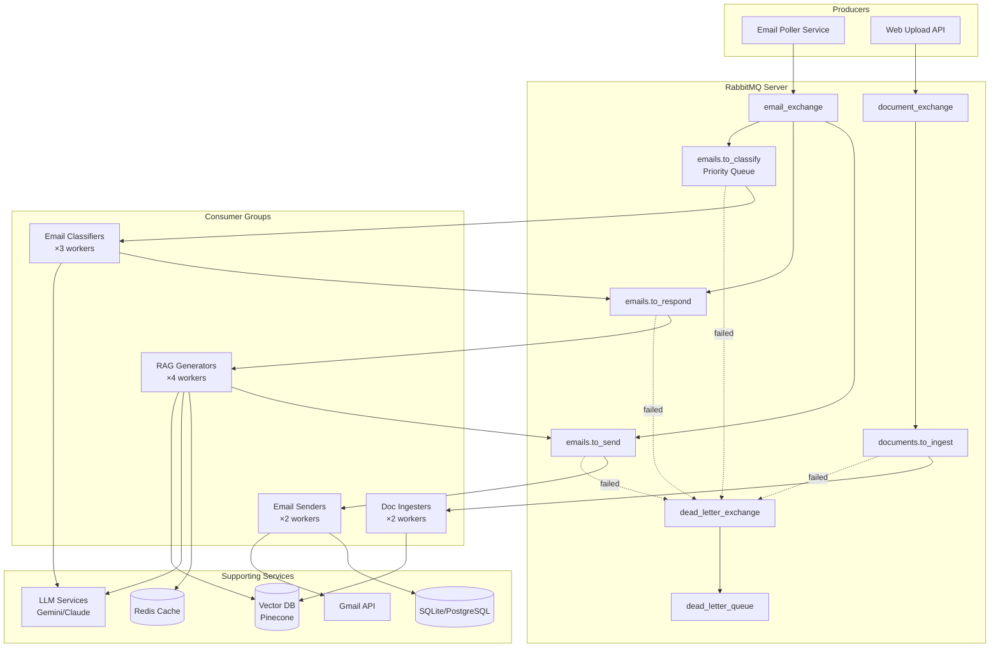

# RabbitMQ Production Architecture

## Executive Summary

This document outlines a production-ready RabbitMQ implementation for the RAG-based email automation system. RabbitMQ provides a simpler, more cost-effective alternative to Kafka while delivering all required functionality for the email processing pipeline.

**Key Benefits**:
- **13x cheaper** than Kafka ($32 vs $426/month)
- **10x simpler** operationally (1 service vs 6+)
- **Perfect use case match** (task queue pattern)
- **Faster development** (30 min vs 4-8 hours integration)

---

## Architecture Overview

### High-Level Design



---

## Queue Design

### Queue Topology

| Queue Name | Purpose | Priority | TTL | DLX |
|------------|---------|----------|-----|-----|
| `emails.to_classify` | New emails waiting for classification | ✅ 1-10 | 1 hour | ✅ |
| `emails.to_respond` | Classified emails needing RAG response | ❌ | 2 hours | ✅ |
| `emails.to_send` | Emails with generated responses ready to send | ❌ | 1 hour | ✅ |
| `documents.to_ingest` | PDFs uploaded for vector DB | ❌ | 30 min | ✅ |
| `dead_letter_queue` | Failed messages for manual review | ❌ | ∞ | ❌ |

---

### Queue Configurations

#### emails.to_classify

**Purpose**: Store incoming emails waiting for LLM classification

**Features**:
- **Priority support**: Urgent emails (priority 8-10) processed first
- **TTL**: 1 hour (auto-expire old emails)
- **DLX**: Failed classifications go to DLQ

**Declaration** (Python):
```python
channel.queue_declare(
    queue='emails.to_classify',
    durable=True,  # Survive broker restart
    arguments={
        'x-max-priority': 10,  # Enable priority 1-10
        'x-message-ttl': 3600000,  # 1 hour in milliseconds
        'x-dead-letter-exchange': 'dead_letter_exchange',
        'x-dead-letter-routing-key': 'failed_emails'
    }
)
```

**Message Schema**:
```json
{
  "message_id": "uuid-v4",
  "timestamp": "2025-12-06T17:00:00Z",
  "email_id": "gmail-message-id",
  "thread_id": "gmail-thread-id",
  "from": "customer@example.com",
  "to": "support@company.com",
  "subject": "Product inquiry",
  "body": "email body text",
  "headers": {},
  "labels": ["INBOX", "UNREAD"],
  "agent_email": "support@company.com",
  "priority": 5,
  "metadata": {
    "received_date": "2025-12-06T16:00:00Z",
    "has_attachments": false
  }
}
```

---

#### emails.to_respond

**Purpose**: Store classified support inquiries waiting for RAG response generation

**Features**:
- **Longer TTL**: 2 hours (RAG processing may take longer)
- **DLX**: RAG failures go to DLQ

**Declaration**:
```python
channel.queue_declare(
    queue='emails.to_respond',
    durable=True,
    arguments={
        'x-message-ttl': 7200000,  # 2 hours
        'x-dead-letter-exchange': 'dead_letter_exchange',
        'x-dead-letter-routing-key': 'failed_emails'
    }
)
```

**Message Schema**:
```json
{
  "message_id": "uuid-v4",
  "timestamp": "2025-12-06T17:00:01Z",
  "original_message_id": "uuid-from-classifier",
  "email_id": "gmail-message-id",
  "thread_id": "gmail-thread-id",
  "from": "customer@example.com",
  "to": "support@company.com",
  "subject": "Product inquiry",
  "body": "email body text",
  "classification": {
    "is_support_inquiry": true,
    "category": "product_question",
    "confidence": 0.95,
    "llm_provider": "gemini"
  },
  "agent_email": "support@company.com"
}
```

---

#### emails.to_send

**Purpose**: Store emails with generated responses ready to send via Gmail

**Declaration**:
```python
channel.queue_declare(
    queue='emails.to_send',
    durable=True,
    arguments={
        'x-message-ttl': 3600000,  # 1 hour
        'x-dead-letter-exchange': 'dead_letter_exchange',
        'x-dead-letter-routing-key': 'failed_emails'
    }
)
```

**Message Schema**:
```json
{
  "message_id": "uuid-v4",
  "timestamp": "2025-12-06T17:00:05Z",
  "original_message_id": "uuid-from-rag",
  "email_id": "gmail-message-id",
  "thread_id": "gmail-thread-id",
  "to": "customer@example.com",
  "reply_to": "support@company.com",
  "subject": "Re: Product inquiry",
  "generated_response": "Thank you for your inquiry...",
  "context_used": [
    {
      "source": "product_manual.pdf",
      "chunk": "Our product features...",
      "similarity_score": 0.89
    }
  ],
  "agent_email": "support@company.com"
}
```

---

#### documents.to_ingest

**Purpose**: Store PDF documents uploaded for vector database ingestion

**Features**:
- **Short TTL**: 30 minutes (should be processed quickly)
- **Single worker**: Process one document at a time (CPU-intensive)

**Declaration**:
```python
channel.queue_declare(
    queue='documents.to_ingest',
    durable=True,
    arguments={
        'x-message-ttl': 1800000,  # 30 minutes
        'x-dead-letter-exchange': 'dead_letter_exchange',
        'x-dead-letter-routing-key': 'failed_documents'
    }
)
```

**Message Schema**:
```json
{
  "message_id": "uuid-v4",
  "timestamp": "2025-12-06T17:00:00Z",
  "document_id": "uuid-v4",
  "filename": "product_manual.pdf",
  "file_path": "/path/to/uploaded/file.pdf",
  "file_size_bytes": 2048576,
  "uploaded_by": "support@company.com",
  "agent_email": "support@company.com",
  "metadata": {
    "upload_source": "web_dashboard",
    "content_type": "application/pdf"
  }
}
```

---

#### dead_letter_queue

**Purpose**: Store failed messages for manual review and debugging

**Features**:
- **No TTL**: Keep forever for analysis
- **No DLX**: Terminal queue

**Declaration**:
```python
channel.queue_declare(
    queue='dead_letter_queue',
    durable=True,
    arguments={}
)
```

**Message Schema** (includes original message + error info):
```json
{
  "message_id": "uuid-v4",
  "timestamp": "2025-12-06T17:00:10Z",
  "original_queue": "emails.to_classify",
  "original_message": { /* original message payload */ },
  "failure_info": {
    "error_message": "LLM quota exceeded for all providers",
    "error_type": "QuotaExceededError",
    "retry_count": 3,
    "stack_trace": "...",
    "consumer_id": "classifier-worker-1"
  }
}
```

---

## Exchange Design

### email_exchange

**Type**: Direct exchange  
**Durable**: Yes  
**Purpose**: Route emails to processing queues

**Routing Keys**:
- `classify` → `emails.to_classify`
- `respond` → `emails.to_respond`
- `send` → `emails.to_send`

---

### document_exchange

**Type**: Direct exchange  
**Durable**: Yes  
**Purpose**: Route documents to ingestion queue

**Routing Keys**:
- `ingest` → `documents.to_ingest`

---

### dead_letter_exchange

**Type**: Direct exchange  
**Durable**: Yes  
**Purpose**: Route failed messages to DLQ

**Routing Keys**:
- `failed_emails` → `dead_letter_queue`
- `failed_documents` → `dead_letter_queue`

---

## Consumer Implementation

### Email Classifier Consumer

**Purpose**: Classify emails using LLM

**Consumer Count**: 3-6 workers

**Code Example**:
```python
"""
RabbitMQ Consumer for email classification.
"""
import pika
import json
import logging
from datetime import datetime
import uuid

from app.services.llm_providers.factory import LLMFactory

logger = logging.getLogger(__name__)

class EmailClassifierConsumer:
    """Consumes incoming emails and classifies them using LLM."""
    
    def __init__(self, rabbitmq_url: str, llm_factory: LLMFactory):
        """Initialize classifier consumer."""
        self.llm_factory = llm_factory
        
        # Connect to RabbitMQ
        params = pika.URLParameters(rabbitmq_url)
        self.connection = pika.BlockingConnection(params)
        self.channel = self.connection.channel()
        
        # Declare queue (idempotent)
        self.channel.queue_declare(queue='emails.to_classify', durable=True)
        self.channel.queue_declare(queue='emails.to_respond', durable=True)
        
        # QoS: Process one message at a time
        self.channel.basic_qos(prefetch_count=1)
        
        logger.info("Email Classifier Consumer initialized")
    
    def classify_email(self, email_body: str, subject: str) -> dict:
        """Classify an email using LLM."""
        prompt = f"""
        Classify the following email as either a "CUSTOMER_SUPPORT_INQUIRY" or "OTHER".
        
        Subject: {subject}
        Body: {email_body}
        
        Return JSON: {{"is_support_inquiry": true/false, "category": "...", "confidence": 0.0-1.0}}
        """
        
        response = self.llm_factory.generate(prompt)
        return json.loads(response)
    
    def callback(self, ch, method, properties, body):
        """Process a single email message."""
        try:
            message = json.loads(body)
            logger.info(f"Processing email: {message['message_id']}")
            
            # Classify the email
            classification = self.classify_email(
                email_body=message['body'],
                subject=message['subject']
            )
            
            # If support inquiry, publish to next queue
            if classification['is_support_inquiry']:
                response_message = {
                    "message_id": str(uuid.uuid4()),
                    "timestamp": datetime.utcnow().isoformat() + "Z",
                    "original_message_id": message['message_id'],
                    "email_id": message['email_id'],
                    "thread_id": message['thread_id'],
                    "from": message['from'],
                    "to": message['to'],
                    "subject": message['subject'],
                    "body": message['body'],
                    "classification": classification,
                    "agent_email": message['agent_email']
                }
                
                # Publish to emails.to_respond
                ch.basic_publish(
                    exchange='',
                    routing_key='emails.to_respond',
                    body=json.dumps(response_message),
                    properties=pika.BasicProperties(delivery_mode=2)
                )
                
                logger.info(f"Email classified as SUPPORT, sent to respond queue")
            else:
                logger.info(f"Email classified as OTHER, ignored")
            
            # Acknowledge message (success)
            ch.basic_ack(delivery_tag=method.delivery_tag)
            
        except Exception as e:
            logger.error(f"Failed to process email: {e}")
            
            # Reject and don't requeue (send to DLX after retries)
            ch.basic_nack(delivery_tag=method.delivery_tag, requeue=False)
    
    def start(self):
        """Start consuming messages."""
        logger.info("Starting Email Classifier Consumer...")
        
        self.channel.basic_consume(
            queue='emails.to_classify',
            on_message_callback=self.callback
        )
        
        try:
            self.channel.start_consuming()
        except KeyboardInterrupt:
            logger.info("Shutting down consumer...")
            self.channel.stop_consuming()
        finally:
            self.connection.close()

# Entry point
if __name__ == '__main__':
    from app.config import Config
    
    rabbitmq_url = f"amqp://{Config.RABBITMQ_USER}:{Config.RABBITMQ_PASS}@{Config.RABBITMQ_HOST}:{Config.RABBITMQ_PORT}/"
    llm_factory = LLMFactory()
    
    consumer = EmailClassifierConsumer(rabbitmq_url, llm_factory)
    consumer.start()
```

---

### RAG Response Generator Consumer

**Purpose**: Generate responses using RAG

**Consumer Count**: 4-8 workers

**Key Implementation Details**:
- Performs vector similarity search
- Generates response with context
- Caches embeddings in Redis for performance
- Publishes to `emails.to_send`

---

### Email Sender Consumer

**Purpose**: Send emails via Gmail API

**Consumer Count**: 2-4 workers

**Key Features**:
- Rate limiting (Gmail API quotas: 250/day free tier)
- Token bucket algorithm for smooth sending
- Database logging
- Error handling for API failures

---

### Document Ingestion Consumer

**Purpose**: Process PDFs and add to vector DB

**Consumer Count**: 1-2 workers (CPU-intensive)

**Key Features**:
- Single message processing (prefetch_count=1)
- Extract text from PDF
- Chunk and embed
- Upsert to vector database
- Progress tracking

---

## Producer Implementation

### Email Producer Service

```python
"""
RabbitMQ Producer Service for publishing email events.
"""
import pika
import json
import logging
from datetime import datetime
import uuid

logger = logging.getLogger(__name__)

class RabbitMQProducerService:
    """Handles producing messages to RabbitMQ queues."""
    
    def __init__(self, rabbitmq_url: str):
        """Initialize RabbitMQ producer."""
        params = pika.URLParameters(rabbitmq_url)
        self.connection = pika.BlockingConnection(params)
        self.channel = self.connection.channel()
        
        # Declare exchanges
        self.channel.exchange_declare(
            exchange='email_exchange',
            exchange_type='direct',
            durable=True
        )
        
        logger.info("RabbitMQ Producer initialized")
    
    def publish_email(self, email_data: dict, priority: int = 5):
        """
        Publish an email to the classification queue.
        
        Args:
            email_data: Email metadata and content
            priority: Priority 1-10 (1=low, 10=high)
        """
        message = {
            "message_id": str(uuid.uuid4()),
            "timestamp": datetime.utcnow().isoformat() + "Z",
            "email_id": email_data.get("id"),
            "thread_id": email_data.get("threadId"),
            "from": email_data.get("from"),
            "to": email_data.get("to"),
            "subject": email_data.get("subject"),
            "body": email_data.get("body"),
            "headers": email_data.get("headers", {}),
            "labels": email_data.get("labels", []),
            "agent_email": email_data.get("agent_email"),
            "priority": priority,
            "metadata": {
                "received_date": email_data.get("internalDate"),
                "has_attachments": email_data.get("has_attachments", False)
            }
        }
        
        try:
            self.channel.basic_publish(
                exchange='',
                routing_key='emails.to_classify',
                body=json.dumps(message),
                properties=pika.BasicProperties(
                    delivery_mode=2,  # Persistent
                    priority=priority
                )
            )
            
            logger.info(f"Published email {message['message_id']} with priority {priority}")
            return message['message_id']
            
        except Exception as e:
            logger.error(f"Failed to publish email: {e}")
            raise
    
    def publish_document(self, document_data: dict):
        """Publish a document for ingestion."""
        message = {
            "message_id": str(uuid.uuid4()),
            "timestamp": datetime.utcnow().isoformat() + "Z",
            "document_id": str(uuid.uuid4()),
            "filename": document_data.get("filename"),
            "file_path": document_data.get("file_path"),
            "file_size_bytes": document_data.get("file_size"),
            "uploaded_by": document_data.get("agent_email"),
            "agent_email": document_data.get("agent_email"),
            "metadata": {
                "upload_source": "web_dashboard",
                "content_type": document_data.get("content_type", "application/pdf")
            }
        }
        
        try:
            self.channel.basic_publish(
                exchange='',
                routing_key='documents.to_ingest',
                body=json.dumps(message),
                properties=pika.BasicProperties(delivery_mode=2)
            )
            
            logger.info(f"Published document {message['document_id']}")
            return message['message_id']
            
        except Exception as e:
            logger.error(f"Failed to publish document: {e}")
            raise
    
    def close(self):
        """Close connection."""
        self.connection.close()
```

---

## Deployment Architecture

### Local Development

**Docker Compose** (already created):
```bash
docker-compose -f docker-compose.rabbitmq.yml up -d
```

**Services**:
- RabbitMQ (with management UI)
- Redis (for caching)

**Resource requirements**:
- Memory: ~1 GB
- CPU: 0.5 cores
- Disk: 5 GB

---

### Production Deployment

#### Single Instance (handles 50K msgs/sec)

**AWS**:
```yaml
Instance: t3.medium (2 vCPU, 4 GB RAM)
Storage: 20 GB EBS
Cost: ~$32/month
```

**Configuration**:
- Persistent volumes for data
- Health checks
- Auto-restart on failure

---

#### High Availability Cluster (3 nodes)

**AWS**:
```yaml
Instances: 3 × t3.medium
Load Balancer: Application Load Balancer
Storage: 3 × 20 GB EBS
Cost: ~$114/month
```

**Features**:
- Queue mirroring (all queues replicated)
- Automatic failover
- Zero downtime deployments

**Cluster Configuration**:
```bash
# On each node
rabbitmqctl set_policy ha-all "^" '{"ha-mode":"all","ha-sync-mode":"automatic"}'
```

---

#### Managed Service (Amazon MQ)

**AWS MQ**:
```yaml
Instance: mq.t3.micro (2 nodes for HA)
Cost: ~$38/month
```

**Benefits**:
- Zero operational overhead
- Automatic backups
- Patch management
- Multi-AZ deployment

---

## Monitoring and Observability

### RabbitMQ Management UI

**Access**: http://localhost:15672

**Key Metrics**:
- Queue lengths
- Message rates (in/out)
- Consumer utilization
- Memory usage
- Connection count

---

### Prometheus Metrics

RabbitMQ exposes Prometheus metrics via plugin:

```bash
# Enable prometheus plugin
rabbitmq-plugins enable rabbitmq_prometheus
```

**Metrics endpoint**: http://localhost:15692/metrics

**Key Metrics**:
```
rabbitmq_queue_messages - Messages in queue
rabbitmq_queue_messages_ready - Messages ready for delivery
rabbitmq_queue_messages_unacknowledged - Messages being processed
rabbitmq_queue_consumers - Active consumers
rabbitmq_channel_messages_published_total - Total published
rabbitmq_channel_messages_delivered_total - Total delivered
```

---

### Grafana Dashboard

Import RabbitMQ dashboard:
- Dashboard ID: 10991
- URL: https://grafana.com/grafana/dashboards/10991

**Panels**:
- Queue depth over time
- Message throughput
- Consumer lag
- Error rate
- Memory/disk usage

---

## Scaling Strategy

### Vertical Scaling

**Increase RabbitMQ instance size**:
- t3.medium → t3.large (4 vCPU, 8 GB RAM)
- Handles 100K+ msgs/sec

**When to scale**:
- CPU usage > 70%
- Memory usage > 80%
- Queue depth growing

---

### Horizontal Scaling (Consumers)

**Add more consumer workers**:
```bash
# Start additional classifier workers
python -m app.consumers.email_classifier_consumer &
python -m app.consumers.email_classifier_consumer &
python -m app.consumers.email_classifier_consumer &
```

**Auto-scaling** (Kubernetes):
```yaml
apiVersion: autoscaling/v2
kind: HorizontalPodAutoscaler
metadata:
  name: email-classifier-hpa
spec:
  scaleTargetRef:
    apiVersion: apps/v1
    kind: Deployment
    name: email-classifier
  minReplicas: 3 
  maxReplicas: 12
  metrics:
  - type: External
    external:
      metric:
        name: rabbitmq_queue_messages_ready
        selector:
          matchLabels:
            queue: emails.to_classify
      target:
        type: AverageValue
        averageValue: "50"
```

**Scaling triggers**:
- Queue depth > 50 messages
- Consumer utilization > 80%
- Message processing time > 5 seconds

---

## Cost Analysis

### Infrastructure Costs (AWS)

| Deployment | Monthly Cost | Throughput| HA |
|------------|-------------|-----------|-----|
| Single Instance (t3.medium) | $32 | 50K msg/sec | ❌ |
| HA Cluster (3 × t3.medium) | $114 | 50K msg/sec | ✅ |
| Amazon MQ (HA) | $38 | 10K msg/sec | ✅ |

**Recommendation**: Start with Amazon MQ for simplicity, migrate to self-hosted cluster if you need higher throughput.

---

### Cost Comparison: RabbitMQ vs Kafka

| Factor | RabbitMQ | Kafka |
|--------|----------|-------|
| **Infrastructure** | $32-114/month | $426-576/month |
| **Operational burden** | Low | High |
| **Required expertise** | Basic | Advanced |
| **Setup time** | 15 minutes | 2-4 hours |
| **Maintenance time** | 1-2 hours/month | 10-20 hours/month |

**Savings**: $394-462/month (92% cost reduction)

---

## Migration from Current Architecture

### Phase 1: Dual-Write (Week 1)

1. Add `RabbitMQProducerService` to `AgentService`
2. Publish emails to RabbitMQ (but continue synchronous processing)
3. Monitor publish success rate
4. **Goal**: 100% of emails published

---

### Phase 2: Classification Consumer (Week 2)

1. Deploy Email Classifier consumer (3 workers)
2. Run in parallel with synchronous classification
3. Compare classification results
4. **Goal**: Classification accuracy parity

---

### Phase 3: RAG and Sender Consumers (Week 3-4)

1. Deploy RAG consumer (4 workers)
2. Deploy Sender consumer (2 workers)
3. Route 10% of emails through RabbitMQ pipeline
4. Gradually increase to 100%
5. **Goal**: Full cutover

---

### Phase 4: Cleanup (Week 5)

1. Turn off synchronous agent
2. Remove old code
3. Monitor for regressions
4. **Goal**: 100% async architecture

---

## Security Considerations

### Authentication

**User creation**:
```bash
rabbitmqctl add_user rag_app rag_password
rabbitmqctl set_permissions -p / rag_app ".*" ".*" ".*"
```

**Environment variables**:
```env
RABBITMQ_USER=rag_app
RABBITMQ_PASS=rag_password
```

---

### TLS Encryption

**Enable TLS** (production):
```bash
# rabbitmq.conf
listeners.ssl.default = 5671
ssl_options.cacertfile = /path/to/ca_certificate.pem
ssl_options.certfile = /path/to/server_certificate.pem
ssl_options.keyfile = /path/to/server_key.pem
ssl_options.verify = verify_peer
ssl_options.fail_if_no_peer_cert = true
```

---

### Access Control

**Virtual hosts** (isolate environments):
```bash
rabbitmqctl add_vhost production
rabbitmqctl add_vhost staging
```

**User permissions**:
- Admin: Full access
- Producers: Publish only
- Consumers: Read only

---

## Conclusion

RabbitMQ provides an ideal message queue solution for the RAG demo:

✅ **Simple**: 1 service, 15-minute setup  
✅ **Cost-effective**: $32/month vs $426/month for Kafka  
✅ **Perfect fit**: Task queue pattern matches email processing  
✅ **Scalable**: Handles 50K msgs/sec (current need: 1 msg/min)  
✅ **Production-ready**: Mature, reliable, well-documented  
✅ **Developer-friendly**: Great UI, easy debugging, fast integration

**Next Steps**:
1. Start RabbitMQ locally (`docker-compose up`)
2. Implement producer service
3. Implement consumers (classifier, RAG, sender)
4. Test end-to-end
5. Deploy to production

---

**Document Version**: 1.0  
**Created**: December 6, 2025  
**Technology**: RabbitMQ 3.13+  
**Status**: Ready for Implementation
